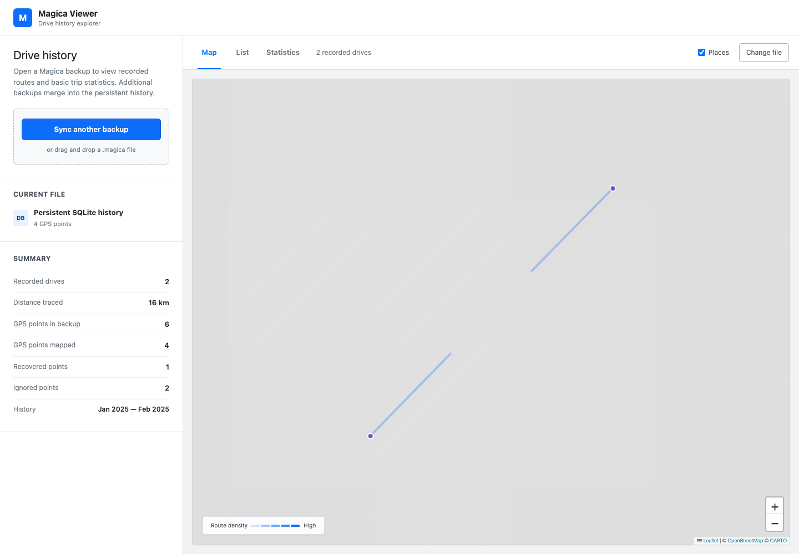
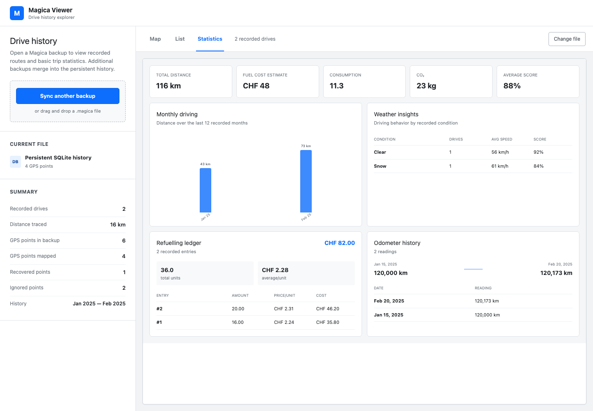

# Magica Viewer

> [!IMPORTANT]
> **This entire repository, including the application, design, tests, documentation, and deployment setup was made with AI.**

Magica Viewer is a browser-based explorer for Magica drive-history backups. It reads `.magica`
SQLite files locally, plots recorded routes on an interactive map, and lists the available drive
details.

## Screenshots

All screenshots use generated fantasy drive data.





## Development

Requirements: Node.js 22.13 or newer.

```bash
npm ci
npm run dev
```

Useful commands:

- `npm run lint` checks the source.
- `npm run format:check` verifies source formatting.
- `npm run build` creates the production build.
- `npm test` runs the unit tests.
- `npm run test:e2e` runs the Playwright browser tests against a production build.

## Architecture

- Next.js-compatible application built with Vinext and Vite
- Leaflet map rendering
- `sql.js` for reading uploaded SQLite backups in the browser
- Server-side SQLite persistence for extracted drive history

Raw backups are processed in browser memory and are not uploaded. Extracted drive records are synced
to the application's SQLite database so they remain available after a reload. Additional backups
merge by record key, preserving older history during incremental imports.

## Docker

Build and run the same image used in production:

```bash
docker build -t magica-viewer .
docker run --rm -p 3000:3000 magica-viewer
```

The container listens on port `3000` and includes an HTTP health check against `GET /`.

## Container deployment

Gitea Actions formats, lints, builds, and tests every change. Unit and browser tests run in parallel
after a successful build, and the workflow publishes a fresh Docker image only after both suites
pass. Branch names are normalized into valid image tags, so the production image uses the `main`
tag.

Configure the deployment platform to run that image, expose port `3000`, and enable the `GET /`
health check. Add a repository Actions secret named `REGISTRY_TOKEN` containing a Gitea personal
access token with package read/write permission.

Attach persistent storage at `/data`. The SQLite database is stored at `/data/magica-viewer.sqlite`;
without the mounted volume, imported history will be lost when the container is replaced.

## License

Magica Viewer is available under the [MIT License](LICENSE). You may freely use, modify, and
distribute it, including for commercial purposes, provided the copyright and license notice are
retained.
